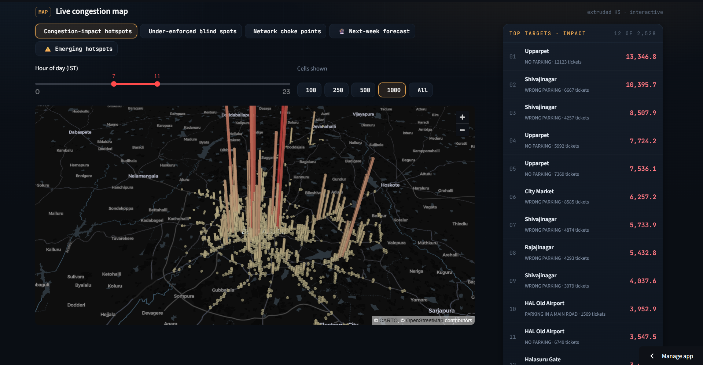

# ParkSight

**Parking-congestion intelligence for Bengaluru Traffic Police.**

ParkSight is a single-file Streamlit dashboard that turns raw parking-violation data into actionable congestion insights. It identifies high-impact illegal-parking hotspots, blind spots in enforcement, emerging problem areas, network choke points, and recommended patrol deployments.

The full application logic lives in [`main.py`](main.py), making the project simple to run, review, and deploy.

## Dashboard Preview

Add your dashboard screenshot at:

```text
assets/parksight-dashboard.png
```

Then it will appear here:



## What ParkSight Does

- Scores each parking violation by estimated congestion impact
- Aggregates violations into H3 hex-grid hotspots
- Detects high-impact areas that may be under-enforced
- Finds network choke points where local obstruction can affect nearby roads
- Flags emerging hotspots using recent activity patterns
- Forecasts next-week congestion impact
- Generates a patrol schedule based on expected impact
- Provides downloadable enforcement recommendations as CSV

## Why This Matters

Raw ticket counts do not always show where parking causes the most traffic disruption. A bus blocking a main road near a junction has a different operational impact than a two-wheeler parked in a lower-risk location.

ParkSight uses an impact-based approach:

```text
impact = violation severity x vehicle bulk x junction multiplier
```

This helps prioritize enforcement where it can reduce the most obstruction, rather than simply where the most tickets were previously issued.

## Tech Stack

- Python
- Streamlit
- pandas
- NumPy
- H3
- scikit-learn
- pydeck

## Project Structure

```text
.
├── main.py
├── requirements.txt
├── jan to may police violation_anonymized791b166 (1).csv
├── README.md
└── assets/
    └── parksight-dashboard.png
```

## Run Locally

Clone the repository:

```bash
git clone https://github.com/ranasweta/Flipkart_Gridlock2.0
cd Flipkart_Gridlock2.0
```

Install dependencies:

```bash
pip install -r requirements.txt
```

Start the Streamlit dashboard:

```bash
streamlit run main.py
```

Run with an explicit dataset path:

```bash
streamlit run main.py -- "jan to may police violation_anonymized791b166 (1).csv"
```

## Headless Mode

You can also run the analysis without launching the dashboard:

```bash
python main.py
```

With an explicit dataset:

```bash
python main.py "jan to may police violation_anonymized791b166 (1).csv"
```

With a row limit for quick testing:

```bash
python main.py "jan to may police violation_anonymized791b166 (1).csv" 50000
```

Headless output is written to:

```text
processed/
```

## Data

The app expects a parking-violation CSV file in the project folder. If no path is provided, `main.py` automatically looks for a CSV file whose name contains `violation`.

The included dataset is:

```text
jan to may police violation_anonymized791b166 (1).csv
```

## Deployment

The easiest deployment option is **Streamlit Community Cloud**.

1. Push this project to GitHub.
2. Go to [Streamlit Community Cloud](https://share.streamlit.io/).
3. Create a new app from your GitHub repository.
4. Set the main file path to:

```text
main.py
```

5. Deploy.

## GitHub Notes

The dataset is large. If GitHub rejects the CSV because of file-size limits, use Git LFS:

```bash
git lfs install
git lfs track "*.csv"
git add .gitattributes
git add .
git commit -m "Add ParkSight app"
git push
```

## Screenshot

To add a screenshot:

1. Run the app locally:

```bash
streamlit run main.py
```

2. Open the dashboard in your browser.
3. Take a screenshot of the main dashboard.
4. Save it as:

```text
assets/parksight-dashboard.png
```

5. Commit and push:

```bash
git add assets/parksight-dashboard.png README.md
git commit -m "Add dashboard screenshot"
git push
```

## License

Add a license file before publishing if this project will be reused by others.
